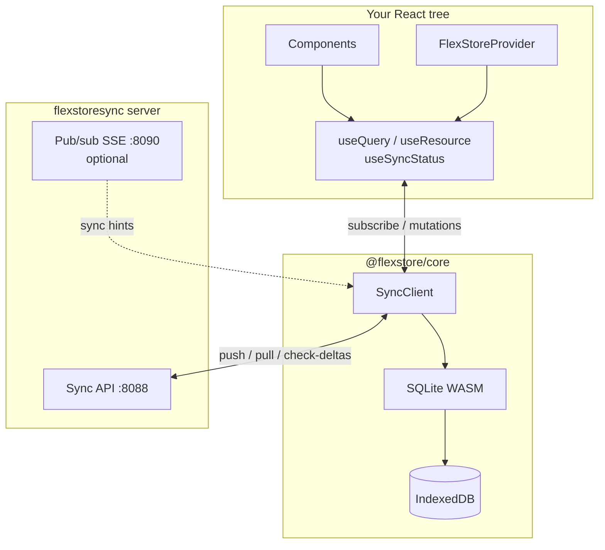
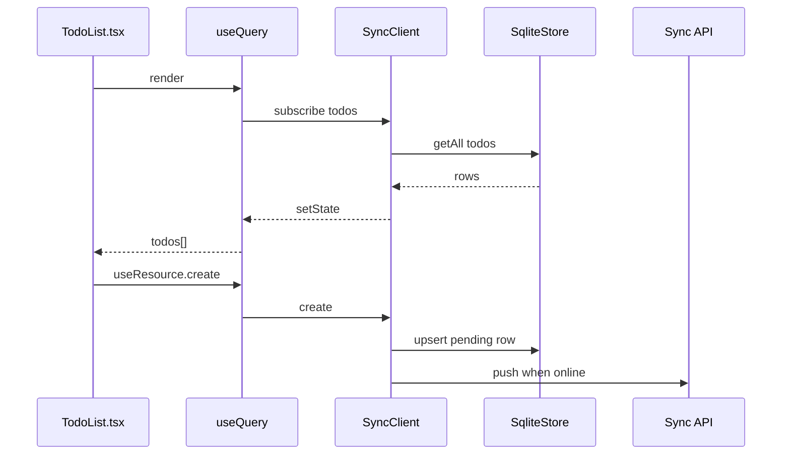

# @flexstore/react

React bindings for **FlexStore** — local-first data that syncs when you're online.

**Repository:** [github.com/flexstoresync/flexstore-react](https://github.com/flexstoresync/flexstore-react)  
**Monorepo source:** [flexstore/packages/react](https://github.com/flexstoresync/flexstore/tree/main/packages/react)

## Install

```bash
npm install @flexstore/react @flexstore/core @journeyapps/wa-sqlite
```

Local storage: **SQLite WASM** with the DB file in **IndexedDB** (default via `@flexstore/core`).

## Data flow





## Sync backend

| Option | Repo / link | Best for |
|--------|-------------|----------|
| **FlexStore hosted** | [flexstore](https://github.com/flexstoresync/flexstore) (`flexstoresync-core/`) | Run sync server; use `X-Api-Key` + `X-Tenant-Id` + `X-Device-Id` (auto-provision on first request) |
| **Self-hosted Docker** | [flexstore-self-host](https://github.com/flexstoresync/flexstore-self-host) | Run your own sync server (Docker Compose) |

Both speak the same protocol. Configure **two URLs**:

| URL | Env var | Default (local) | Purpose |
|-----|---------|-----------------|--------|
| Sync API | `VITE_FLEXSTORE_SYNC_URL` | `http://localhost:8088` | push / pull / check-deltas |
| Pub/sub | `VITE_FLEXSTORE_PUBSUB_URL` | `http://localhost:8090` | SSE sync hints (optional) |
| Pub/sub fallback poll | `VITE_FLEXSTORE_PUBSUB_FALLBACK_POLL_MS` | `60000` | `check-deltas` safety net while SSE is connected |
| Reconnect poll | `VITE_FLEXSTORE_POLL_INTERVAL_MS` | `4000` | Poll when pub/sub is down or not configured |

Set `apiKey`, `tenantId`, and `deviceId` (or let the SDK auto-generate device id) — see [self-host headers](https://github.com/flexstoresync/flexstore-self-host/blob/main/docs/headers.md).

---

## Recommended folder structure

Define **one resource per file**, import them into a single registry, and keep sync config separate from UI:

```
src/
  main.tsx
  index.css
  App.tsx                 # FlexStoreProvider + layout
  App.css
  components/
    TodoList.tsx          # useQuery / useResource hooks
  sync/
    config.ts             # baseUrl, apiKey, tenantId from env
    registry.ts           # resourceRegistry(...imports)
    resources/
      todos.ts            # defineResource({ name: 'todos', ... })
      users.ts            # another resource in its own file
```

Full working files: [`examples/todos-app/`](./examples/todos-app/) in this repo ([flexstore-react](https://github.com/flexstoresync/flexstore-react)), also mirrored in the monorepo at `developer/tests/mytodo/`.

---

## Resources

Use `defineResource` in each file and `resourceRegistry` to combine them:

Use `defineResource` and `resourceRegistry` from **`@flexstore/core`** (not `@flexstore/react` — Vite and older react versions may not resolve re-exports):

```ts
// src/sync/resources/todos.ts
import { defineResource } from '@flexstore/core';

export const todosResource = defineResource({
  name: 'todos',
  attributes: { title: 'string', done: 'boolean' },
});
```

```ts
// src/sync/registry.ts
import { resourceRegistry } from '@flexstore/core';
import { todosResource } from './resources/todos';
import { usersResource } from './resources/users';

export const registry = resourceRegistry(todosResource, usersResource);
```

```ts
// src/sync/config.ts
import type { SyncClientConfig } from '@flexstore/react';
import { parsePollIntervalMs } from '@flexstore/core';
import { registry } from './registry';

export function buildSyncConfig(): SyncClientConfig {
  return {
    baseUrl: import.meta.env.VITE_FLEXSTORE_SYNC_URL,
    pubsubUrl: import.meta.env.VITE_FLEXSTORE_PUBSUB_URL,
    apiKey: import.meta.env.VITE_FLEXSTORE_API_KEY,
    tenantId: import.meta.env.VITE_FLEXSTORE_TENANT_ID,
    pubsubFallbackPollMs: parsePollIntervalMs(
      import.meta.env.VITE_FLEXSTORE_PUBSUB_FALLBACK_POLL_MS,
      60_000,
    ),
    pollIntervalDisconnectedMs: parsePollIntervalMs(
      import.meta.env.VITE_FLEXSTORE_POLL_INTERVAL_MS,
      4_000,
    ),
    resources: registry,
  };
}
```

### `ResourceDefinition` type

| Field | Required | Description |
|-------|----------|-------------|
| `name` | yes | Resource name used in `useQuery('todos')` |
| `attributes` | yes | Flat scalar fields: `'string' \| 'boolean' \| 'integer' \| 'float'` |
| `dependsOn` | no | Parent resources pulled first |
| `pullSchema` | no | Server pull projection (`select`, `where`, `include`) |

TypeScript types ship with the package (`ResourceDefinition`, `SyncClientConfig`, etc.).

---

## App entry

```tsx
// src/App.tsx
import { FlexStoreProvider } from '@flexstore/react';
import { buildSyncConfig } from './sync/config';
import { TodoList } from './components/TodoList';
import './App.css';

export function App() {
  return (
    <FlexStoreProvider config={buildSyncConfig()}>
      <TodoList />
    </FlexStoreProvider>
  );
}
```

```tsx
// src/components/TodoList.tsx
import { useQuery, useResource, useSyncStatus, useRealtimeStatus } from '@flexstore/react';

export function TodoList() {
  const todos = useQuery('todos', { done: false });
  const { create, update } = useResource('todos');
  const status = useSyncStatus();
  const realtime = useRealtimeStatus(); // { connected, baseUrl, pubsubUrl, enabled }

  // ...
}
```

> **Note:** `useQuery` takes a flat filter: `{ done: false }`, not `{ where: { done: false } }`.
> The `{ where: ... }` shape is for server **pull schema**, not local queries.

See [`examples/todos-app/src/App.tsx`](./examples/todos-app/src/App.tsx),
[`App.css`](./examples/todos-app/src/App.css), and
[`components/TodoList.tsx`](./examples/todos-app/src/components/TodoList.tsx).

---

## Environment (Vite)

```bash
# .env.local
VITE_FLEXSTORE_SYNC_URL=http://localhost:8088
VITE_FLEXSTORE_PUBSUB_URL=http://localhost:8090
VITE_FLEXSTORE_API_KEY=your-api-key
VITE_FLEXSTORE_TENANT_ID=your-tenant-id
# Optional — fallback check-deltas while SSE is connected (default 60000 ms)
VITE_FLEXSTORE_PUBSUB_FALLBACK_POLL_MS=60000
# Optional — poll when pub/sub is down (default 4000 ms)
VITE_FLEXSTORE_POLL_INTERVAL_MS=4000
```

When pub/sub is connected, the SDK still runs `check-deltas` on a **fallback timer** (default **60s**) in case hints are missed. When pub/sub is down, it polls every **4s**. Hints trigger an immediate targeted pull for the affected resource only.

For **self-hosted**, sign up at `http://localhost:8088/dashboard/`, create a project, and copy the API key and tenant id from there.

---

## Related repos

| Repo | Role |
|------|------|
| [flexstore-core](https://github.com/flexstoresync/flexstore-core) | `@flexstore/core` sync engine |
| [flexstore-self-host](https://github.com/flexstoresync/flexstore-self-host) | Docker Compose self-host |
| [flexstore](https://github.com/flexstoresync/flexstore) | Monorepo (server, docs, examples) |

---

## API

| Export | Description |
|--------|-------------|
| `defineResource(def)` | Define one resource (use in `resources/*.ts`) |
| `resourceRegistry(...resources)` | Merge resources into an array for config |
| `FlexStoreProvider` | Boots the sync client and wraps your app |
| `useQuery(resource, filter?)` | Live local query; re-renders on store changes |
| `useResource(resource)` | `{ create, update, remove, syncNow }` |
| `useSyncStatus()` | Full status incl. `realtimeConnected`, `baseUrl`, `pubsubUrl` |
| `useRealtimeStatus()` | `{ connected, baseUrl, pubsubUrl, enabled }` |
| `useReady()` | `true` after IndexedDB init |
| `useClient()` | Raw `@flexstore/core` client |
| `useSyncNow()` | Trigger an immediate sync |
| `useSetPaused()` | Pause/resume background sync |

Legacy aliases `SyncProvider` and `SyncCtx` are exported for migration.

---

## License

MIT — see [LICENSE](./LICENSE).
