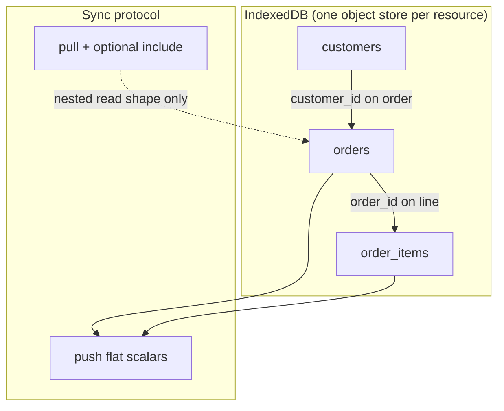

# Managing relationships in React

FlexStore models related data as **separate syncable resources** connected by **ID fields** (foreign keys stored as flat attributes). There is no nested `push` payload — parents and children are independent rows that sync on their own version streams.

This guide covers how to declare those links, keep sync order safe, and render related data in React.

---

## Mental model



| Concept | What it is |
|---------|------------|
| **Resource** | One table-like collection (`orders`, `customers`, `order_items`) |
| **Relationship** | A scalar FK on the child: `order_id`, `customer_id`, `faculty_id` |
| **`dependsOn`** | Declares parent resources that must sync **before** children |
| **`pullSchema.include`** | Optional server-side join when **pulling** — nests parent rows under an alias in the response |

**Push** always sends flat scalars. **Pull** can return nested objects via `include`, but each resource still has its own local store.

---

## 1. Declare resources (one file per resource)

Parent first in the folder; child references parent by ID.

```ts
// src/sync/resources/customers.ts
import { defineResource } from '@flexstore/core';

export const customersResource = defineResource({
  name: 'customers',
  softDeletes: true,
  tenantScoped: true,
  attributes: {
    name: 'string',
    email: 'string',
  },
});
```

```ts
// src/sync/resources/orders.ts
import { defineResource } from '@flexstore/core';

export const ordersResource = defineResource({
  name: 'orders',
  softDeletes: true,
  tenantScoped: true,
  dependsOn: ['customers'],
  attributes: {
    customer_id: 'string',
    status: 'string',
    total: 'float',
  },
  pullSchema: {
    select: ['customer_id', 'status', 'total'],
    include: {
      customer: {
        resource: 'customers',
        local_key: 'customer_id',
        foreign_key: 'id',
        select: ['name', 'email'],
      },
    },
  },
});
```

```ts
// src/sync/resources/order-items.ts
import { defineResource } from '@flexstore/core';

export const orderItemsResource = defineResource({
  name: 'order_items',
  softDeletes: true,
  tenantScoped: true,
  dependsOn: ['orders'],
  attributes: {
    order_id: 'string',
    item_name: 'string',
    qty: 'integer',
    unit_price: 'float',
  },
});
```

### `dependsOn` rules

- List every **parent** resource whose rows must exist before the child can be applied.
- Parents must appear **earlier** in your registry array (see below).
- Use a DAG — no cycles (`order_items → orders → order_items` is invalid).

Typical chains:

```
customers → orders → order_items
schools → faculty → teachers
schools → faculty → students → support_tickets
```

See the [school Postman collection](https://github.com/flexstoresync/flexstore-self-host/tree/main/postman/school) for a full hierarchy example.

---

## 2. Register in pipeline order

```ts
// src/sync/registry.ts
import { resourceRegistry } from '@flexstore/core';
import { customersResource } from './resources/customers';
import { ordersResource } from './resources/orders';
import { orderItemsResource } from './resources/order-items';

/** Parents before children — sync push/pull follows this order. */
export const registry = resourceRegistry(
  customersResource,
  ordersResource,
  orderItemsResource,
);
```

**Important:** Sync runs resources in **registry array order**. Put parents first. `dependsOn` documents the dependency graph and matches the protocol design (`docs/07-resource-registry.md`); keep it aligned with the order you pass to `resourceRegistry()`.

---

## 3. Create related records in React

Always create the **parent** first (locally — works offline). Use the returned `id` on the child.

```tsx
import { useResource } from '@flexstore/react';

function NewOrderForm() {
  const customers = useResource('customers');
  const orders = useResource('orders');
  const orderItems = useResource('order_items');

  const createOrderWithLine = async (customerId: string) => {
    const order = await orders.create({
      customer_id: customerId,
      status: 'open',
      total: 0,
    });

    await orderItems.create({
      order_id: order.id,
      item_name: 'Widget',
      qty: 1,
      unit_price: 9.99,
    });
  };

  // ...
}
```

Each `create` writes to IndexedDB immediately and queues a push when sync is active. Order of creation should match your dependency graph.

---

## 4. Query and join in the UI

Each resource has its own live query. Join in the component (or a small hook).

### Separate queries + `useMemo` join

```tsx
import { useMemo } from 'react';
import { useQuery } from '@flexstore/react';

function OrderList() {
  const orders = useQuery('orders');
  const customers = useQuery('customers');

  const customerById = useMemo(
    () => new Map(customers.map((c) => [String(c.id), c])),
    [customers],
  );

  return (
    <ul>
      {orders.map((order) => {
        const customer = customerById.get(String(order.customer_id));
        return (
          <li key={String(order.id)}>
            {customer?.name ?? 'Unknown customer'} — {order.status}
          </li>
        );
      })}
    </ul>
  );
}
```

### Filter children by parent

```tsx
function OrderLines({ orderId }: { orderId: string }) {
  const lines = useQuery('order_items', { order_id: orderId });

  return (
    <ul>
      {lines.map((line) => (
        <li key={String(line.id)}>
          {line.item_name} × {line.qty}
        </li>
      ))}
    </ul>
  );
}
```

> **Local filters:** `useQuery('order_items', { order_id: orderId })` uses exact equality on stored fields. Use a flat object — not `{ where: { order_id: orderId } }` (that shape is for server `pullSchema.where` only).

---

## 5. Nested data from `pullSchema.include`

When a resource defines `pullSchema.include`, pulled rows may carry nested objects under the alias:

```json
{
  "id": "order-uuid",
  "customer_id": "customer-uuid",
  "status": "open",
  "customer": {
    "id": "customer-uuid",
    "name": "Acme Corp",
    "email": "billing@acme.com"
  }
}
```

After pull, the nested `customer` object is stored on the local order row. You can read it directly:

```tsx
function OrderRow({ order }: { order: Record<string, unknown> }) {
  const customer = order.customer as { name?: string } | undefined;
  return <span>{customer?.name ?? '…'}</span>;
}
```

**Caveats:**

- `include` affects **pull responses only** — not push.
- Nested objects are a **read convenience**; the canonical customer row still lives in the `customers` resource. Prefer separate `useQuery('customers')` when you need live updates to the parent across many screens.
- Deep nesting is supported (`teachers` → `faculty` → `school`) — see school Postman examples.

---

## 6. School domain example

A realistic hierarchy:

| Resource | FK | `dependsOn` |
|----------|-----|-------------|
| `schools` | — | — |
| `faculty` | `school_id` | `schools` |
| `teachers` | `faculty_id` | `faculty` |
| `students` | `faculty_id` | `faculty` |
| `support_tickets` | `student_id` | `students` |

```ts
export const registry = resourceRegistry(
  schoolsResource,
  facultyResource,
  teachersResource,
  studentsResource,
  supportTicketsResource,
);
```

React screen pattern:

```tsx
function FacultyTeachers({ facultyId }: { facultyId: string }) {
  const teachers = useQuery('teachers', { faculty_id: facultyId });
  // ...
}
```

---

## 7. Deletes and orphans

With `softDeletes: true` (default for most entities):

- `remove(id)` writes a **tombstone** locally and syncs a delete op.
- Children are **not** auto-deleted — your app or Postgres connector rules decide cascade behavior.
- Offline: create parent → create child → delete parent → child may reference a tombstoned parent until you handle it in UI logic.

Filter tombstones out of lists with `useQuery` — deleted rows are excluded automatically.

---

## 8. Checklist for new relationships

1. Add parent and child resource files under `src/sync/resources/`.
2. Put FK scalar(s) on the child `attributes` map.
3. Set `dependsOn` on the child.
4. Register **parents before children** in `registry.ts`.
5. Create parents before children in mutation code.
6. Use one `useQuery` per resource; join in UI or filter children by FK.
7. Optionally add `pullSchema.include` when you want nested read shapes from the server.
8. If using the Postgres connector, add matching mappings (`docs/06-postgres-connector.md`).

---

## Further reading

| Doc | Topic |
|-----|--------|
| [07-resource-registry](../../../docs/07-resource-registry.md) | `dependsOn`, pipeline order, scoping flags |
| [03-sync-protocol](../../../docs/03-sync-protocol.md) | `pullSchema`, `include`, push flat-scalar rules |
| [School Postman](https://github.com/flexstoresync/flexstore-self-host/tree/main/postman/school) | Push/pull examples with nested includes |
| [@flexstore/core README](../../core/README.md) | `defineResource`, `SyncClient`, store layer |
